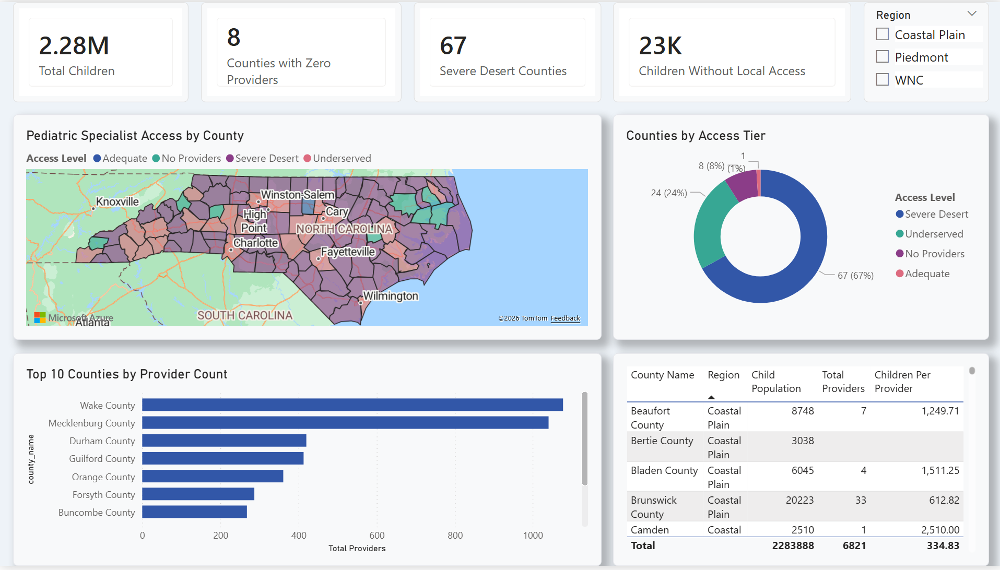
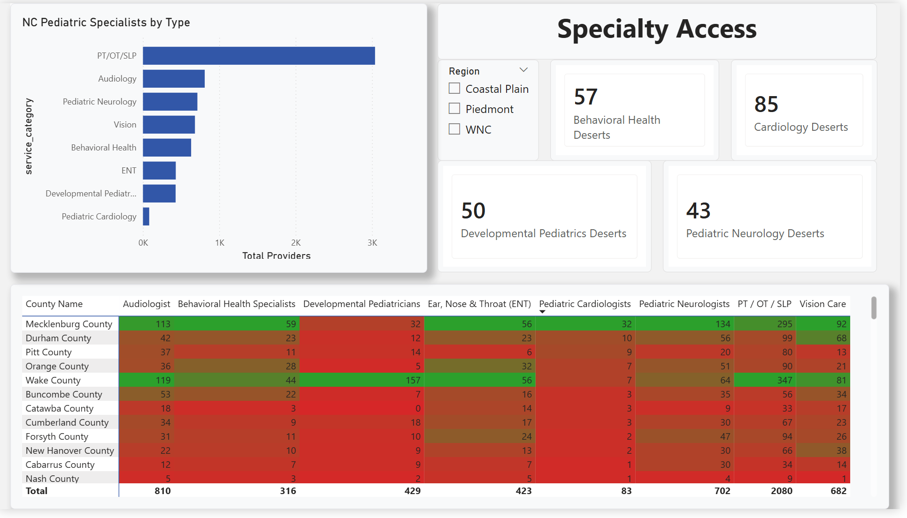
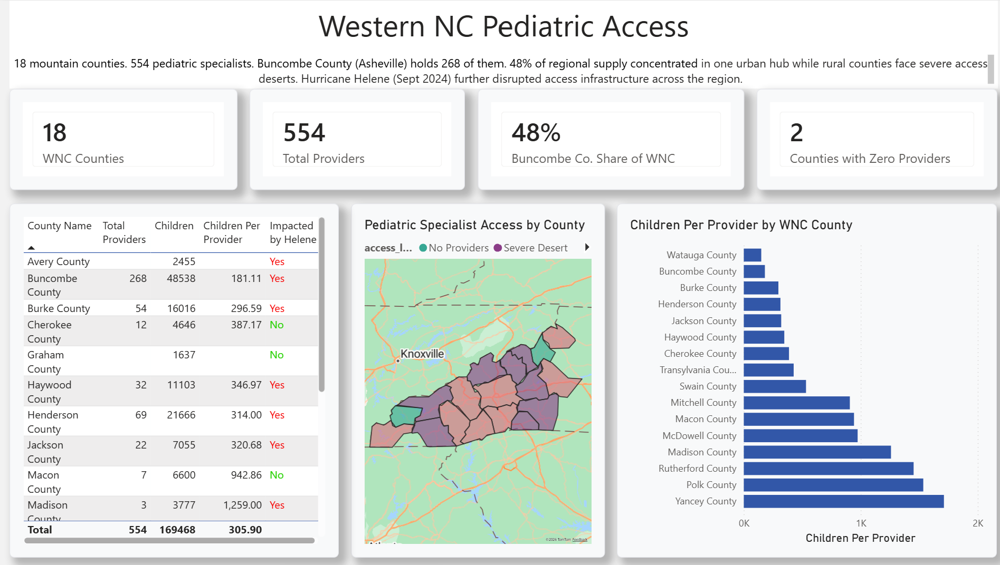
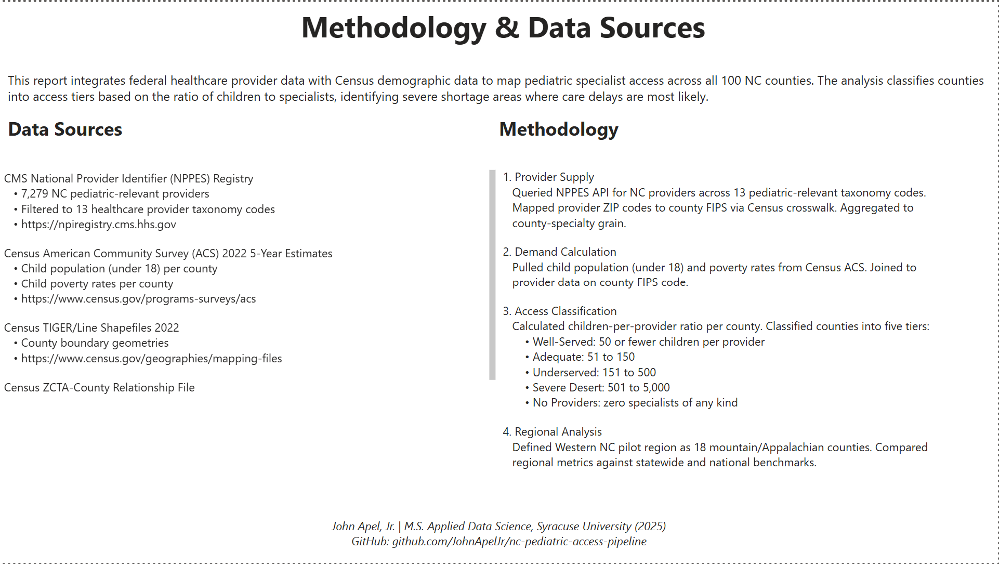

# NC Pediatric Specialist Access — Power BI Report

A four-page interactive Power BI report mapping pediatric specialist supply against child population demand across North Carolina's 100 counties. Built as a stakeholder-facing BI deliverable on the same dataset behind the [NC Pediatric Access Python Pipeline](https://github.com/JohnApelJr/nc-pediatric-access-pipeline).



---

## Project Overview

This report translates a published county-level access desert analysis into an executive dashboard with regional drill-down, specialty-specific shortage tracking, and a fully documented methodology page. Built in Power BI Desktop on a five-table star schema with custom DAX measures, Azure Maps choropleth integration, and conditional formatting throughout.

The underlying dataset and analysis come from a Python pipeline. This Power BI version demonstrates end-to-end BI delivery: data modeling, DAX measure development, visualization design, and methodology documentation in a format suitable for non-technical stakeholders, clinical partners, and policy audiences.

---

## Key Findings

- **2.28 million children** in North Carolina, distributed across 100 counties
- **67 of 100 counties (67%)** classified as Severe Access Deserts, defined as more than 500 children per pediatric specialist
- **8 counties** have zero pediatric specialists of any kind, leaving **23,000+ children** without local access to pediatric care
- **48% of all Western NC pediatric specialists** are concentrated in a single county (Buncombe / Asheville), while 17 of 18 WNC counties have severe gaps
- **2 WNC counties** (Avery and Graham) have zero providers across every pediatric specialty tracked
- **Hurricane Helene (Sept 2024)** disrupted pediatric care infrastructure across 16 of 18 WNC counties

---

## Report Pages

| Page | Purpose |
|------|---------|
| 1. Overview | Statewide KPIs, county-level access map, tier distribution, top-10 provider counties, regional filter |
| 2. Specialty Access | Specialty-specific desert counts, full county-by-specialty matrix with conditional formatting, total provider counts by service category |
| 3. Western NC Deep Dive | 18-county regional analysis, Helene impact tracking, children-per-provider ratios, county-level Helene status |
| 4. Methodology & Data Sources | Data sources, access tier definitions, regional methodology, citation footer |

---

## Data Sources

| Source | Description | Records |
|--------|-------------|---------|
| [CMS NPPES Provider Registry](https://npiregistry.cms.hhs.gov) | NC pediatric provider locations across 13 taxonomy codes | 7,279 records (6,821 deduplicated) |
| [Census ACS 5-Year (2022)](https://www.census.gov/programs-surveys/acs) | Child population, poverty rates by county | 100 NC counties |
| [Census TIGER/Line](https://www.census.gov/geographies/mapping-files.html) | County boundary shapefiles for choropleth visualizations | 100 county geometries |
| [Census ZCTA-County Crosswalk](https://www.census.gov/geo/maps-data/) | ZIP code to county FIPS code mapping for provider geocoding | NC ZIP-to-FIPS |

---

## Specialties Tracked

Pediatric Neurology · PT/OT/SLP · Developmental Pediatrics · Pediatric Cardiology · Behavioral Health · Audiology · ENT/Otolaryngology · Ophthalmology/Vision

Specialty mapping uses Healthcare Provider Taxonomy Codes (NUCC) covering the referral types most common in pediatric care coordination.

---

## Data Model

Five-table star schema:

- **fact_county_metrics** (100 rows): county-level child population, poverty, region assignment
- **fact_providers** (6,821 rows): individual provider records with specialty classification
- **dim_county** (100 rows): county metadata, FIPS codes, region grouping
- **dim_specialty** (8 rows): specialty categories
- **dim_access_tier** (5 rows): access classification thresholds

Foreign keys hidden from the Data pane. Region-aware filtering uses `ALLEXCEPT(dim_county, dim_county[region])` for KPIs that need to respect page-level region filters while clearing other filter context.

### Key DAX Measures

```dax
Counties with Zero Providers = 
CALCULATE(
    DISTINCTCOUNT(fact_county_metrics[county_fips]),
    FILTER(
        ALLEXCEPT(dim_county, dim_county[region]),
        [Total Providers] = 0
    )
)
```

```dax
Severe Desert Counties = 
CALCULATE(
    DISTINCTCOUNT(fact_county_metrics[county_fips]),
    FILTER(
        ALLEXCEPT(dim_county, dim_county[region]),
        [Children Per Provider] > 500
    )
)
```

```dax
Buncombe Share of WNC = 
DIVIDE(
    CALCULATE([Total Providers], dim_county[county_name] = "Buncombe County"),
    CALCULATE([Total Providers], dim_county[region] = "WNC")
)
```

---

## Tech Stack

- **Power BI Desktop** for report development
- **DAX** for custom measures and calculated columns
- **Azure Maps** for choropleth visualizations
- **M / Power Query** for data shaping from CSV source
- **Star schema** dimensional model with five tables and hidden foreign keys

---

## Access Tier Definitions

| Tier | Children per Provider |
|------|----------------------|
| Well-Served | 50 or fewer |
| Adequate | 51 to 150 |
| Underserved | 151 to 500 |
| Severe Desert | 501 to 5,000 |
| No Providers | zero specialists of any kind |

---

## How to Use

1. Download `NC_Pediatric_Access_Report.pbix` from this repo
2. Open in Power BI Desktop (free, Windows-only download from [powerbi.microsoft.com](https://powerbi.microsoft.com))
3. The .pbix includes embedded data; no external connections required
4. To explore the structure without the full data, open `NC_Pediatric_Access_Report.pbit` (template version)

Mac users: Power BI Desktop is Windows-only. Run via Parallels, Boot Camp, or Windows on ARM.

---

## Screenshots

### Page 1: Overview


### Page 2: Specialty Access


### Page 3: Western NC Deep Dive


### Page 4: Methodology & Data Sources


---

## Related Work

- [NC Pediatric Access Pipeline](https://github.com/JohnApelJr/nc-pediatric-access-pipeline): Python pipeline with 7,279 provider records, full geospatial analysis. Source data and analytical methodology for this report.
- [NC Prenatal Care Access](https://github.com/JohnApelJr/nc-prenatal-care-access): Companion analysis of OB/GYN access deserts across NC's 100 counties.
- [Chronic Disease Geospatial Pipeline](https://github.com/JohnApelJr/chronic-disease-geospatial-pipeline): National-scale county-level health analysis covering 2,956 U.S. counties.

---

## Author

**John Apel, Jr.**
M.S. Applied Data Science, Syracuse University (December 2025)

[Portfolio](https://johnapeljr.github.io) · [LinkedIn](https://linkedin.com/in/john-apel-76700154) · [GitHub](https://github.com/JohnApelJr)
